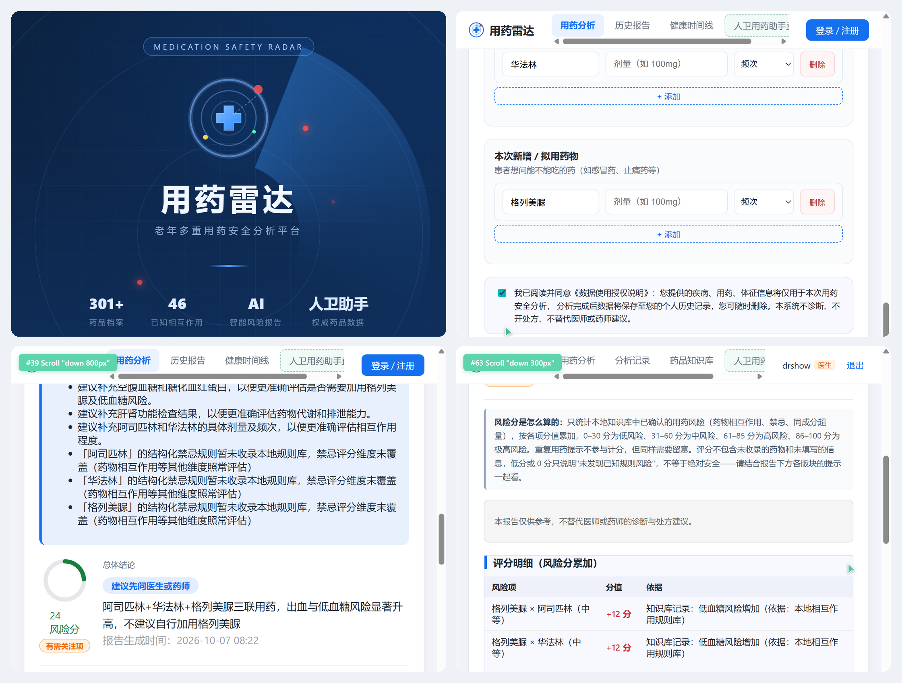
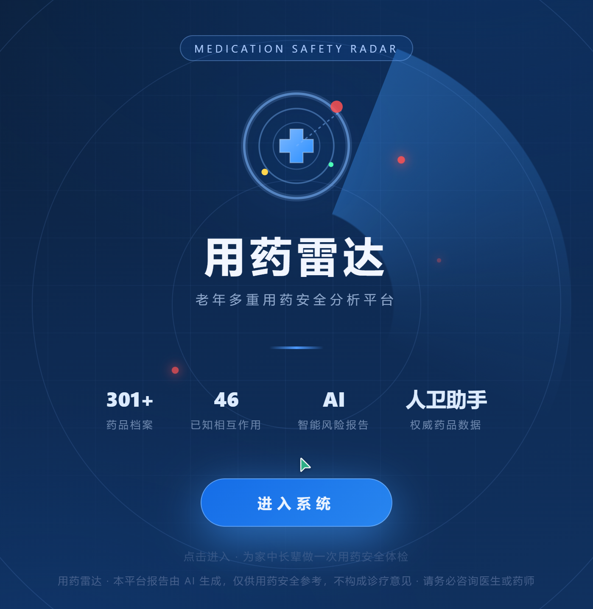
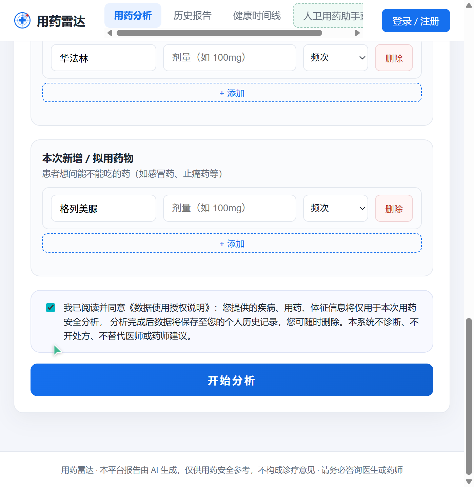
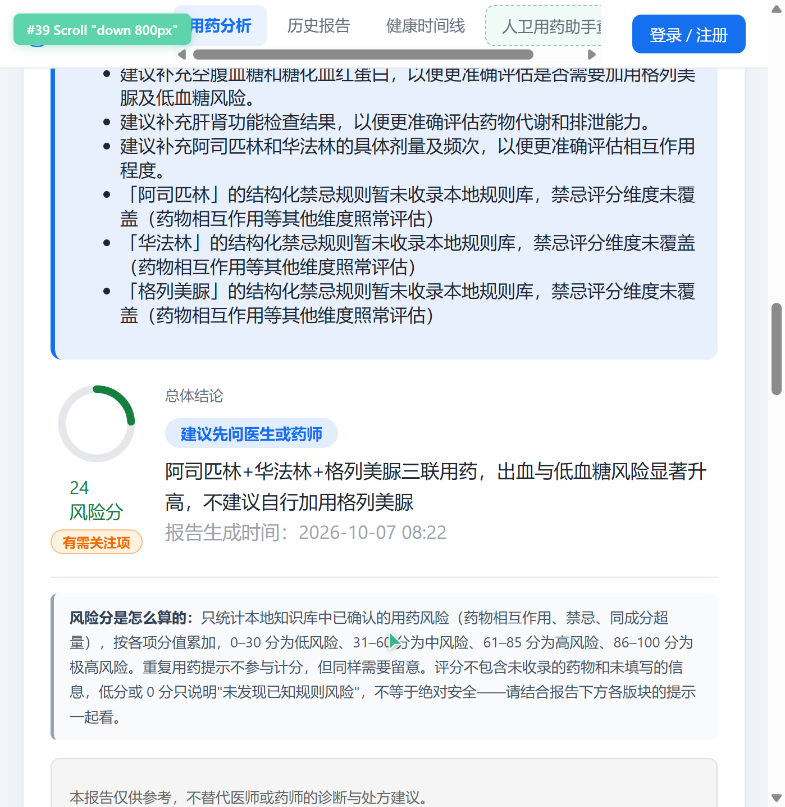
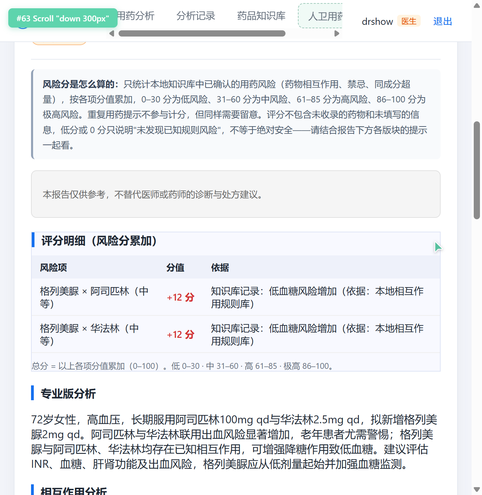
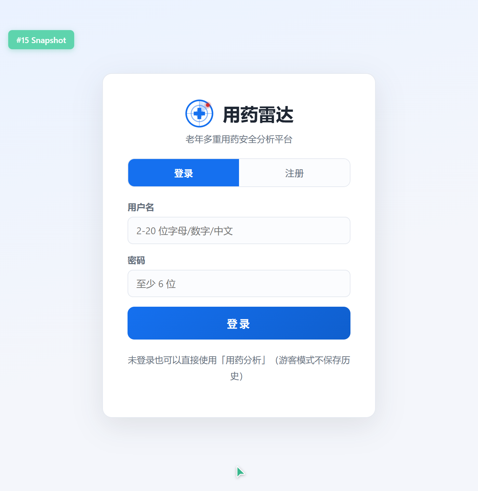
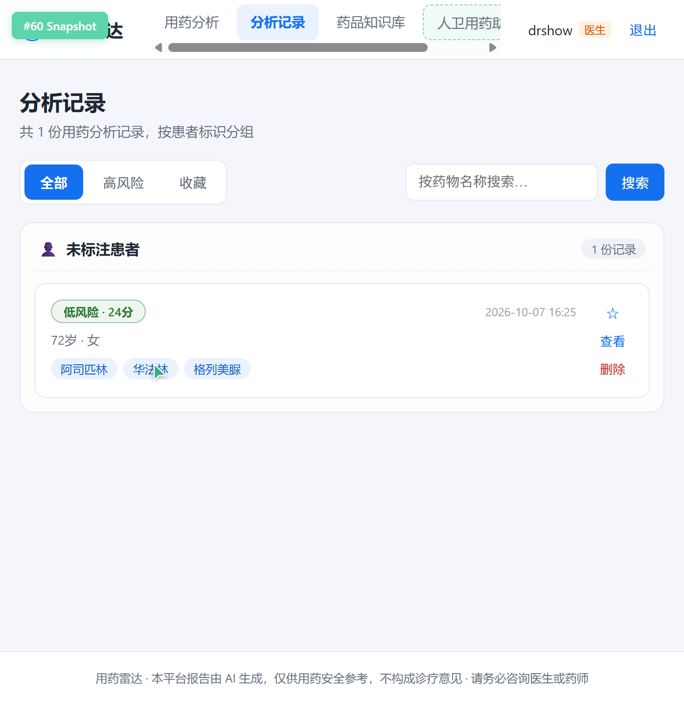
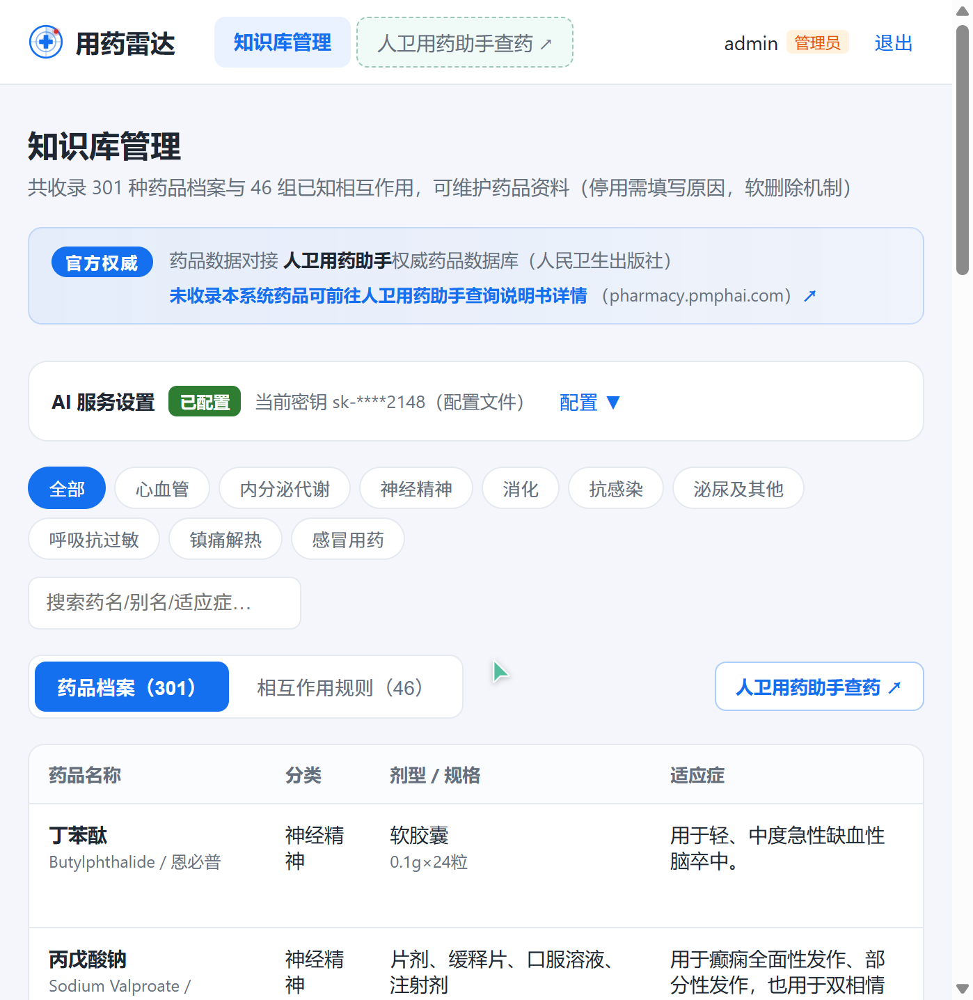
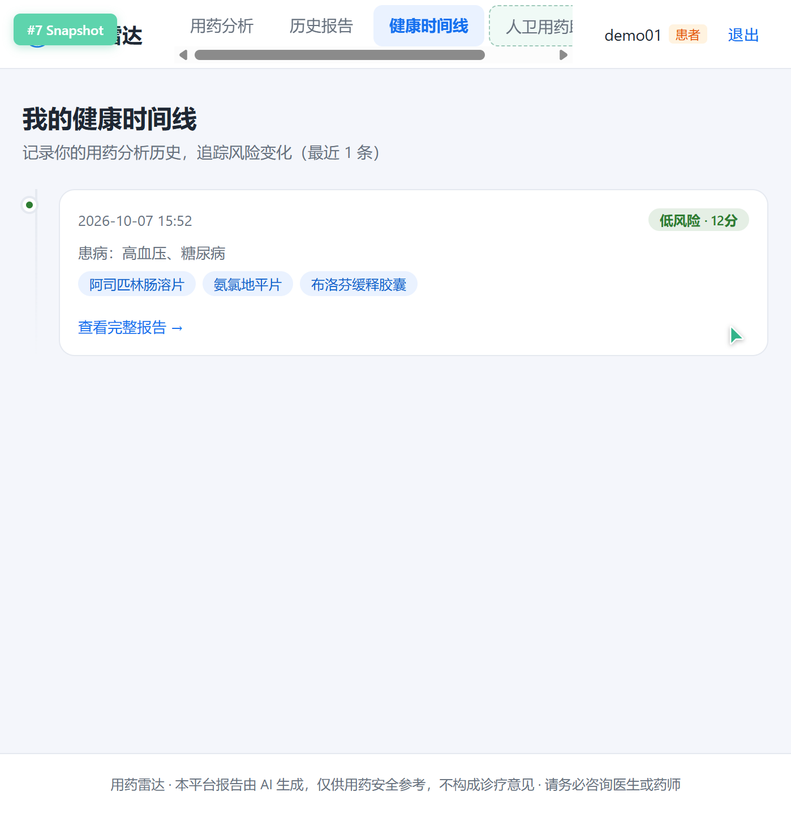
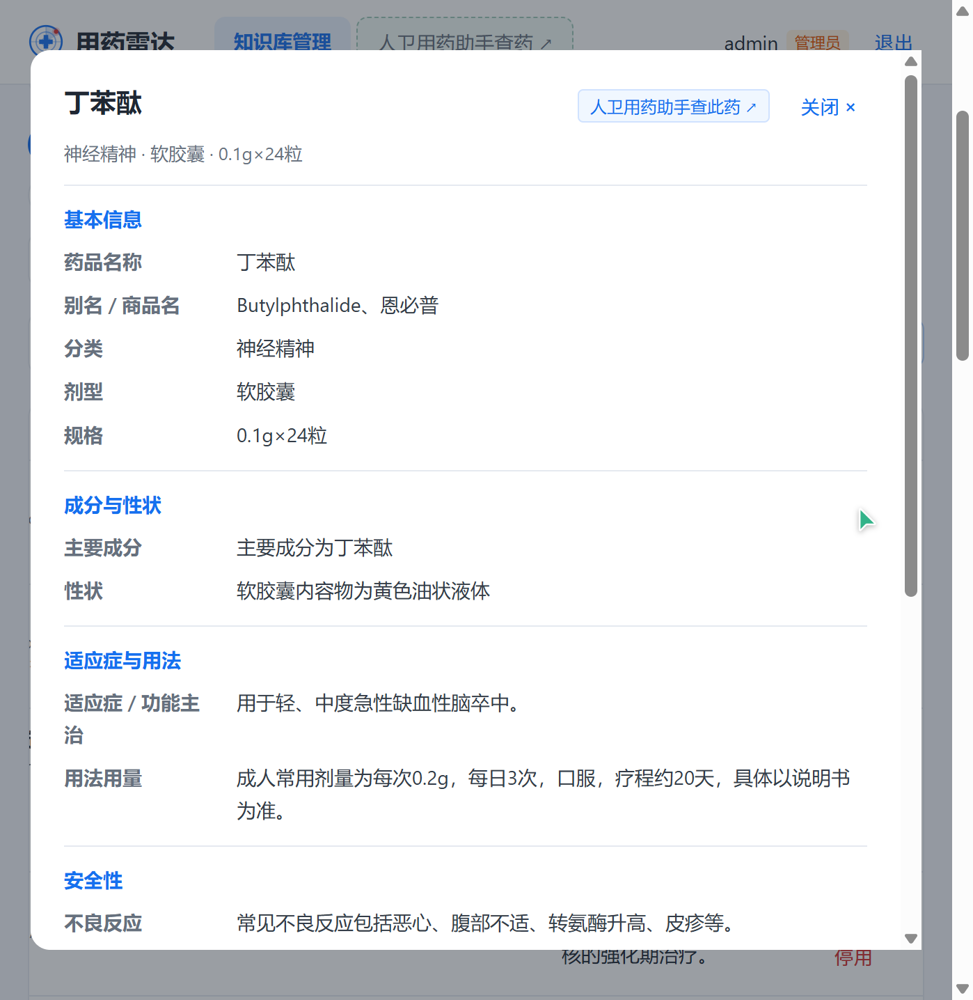

# 用药雷达 · 界面展示

> 老年多重用药安全分析平台。以下均为系统真实运行截图。

## 界面总览

## 分页截图

### 1. 欢迎页 · 产品介绍

### 2. 用药分析 · 信息填写

### 3. 分析报告 · 患者视图

### 4. 分析报告 · 医生专业视图

### 5. 登录 / 注册

### 6. 历史报告列表

### 7. 药品知识库

### 8. 健康时间线

### 9. 药品详情页

