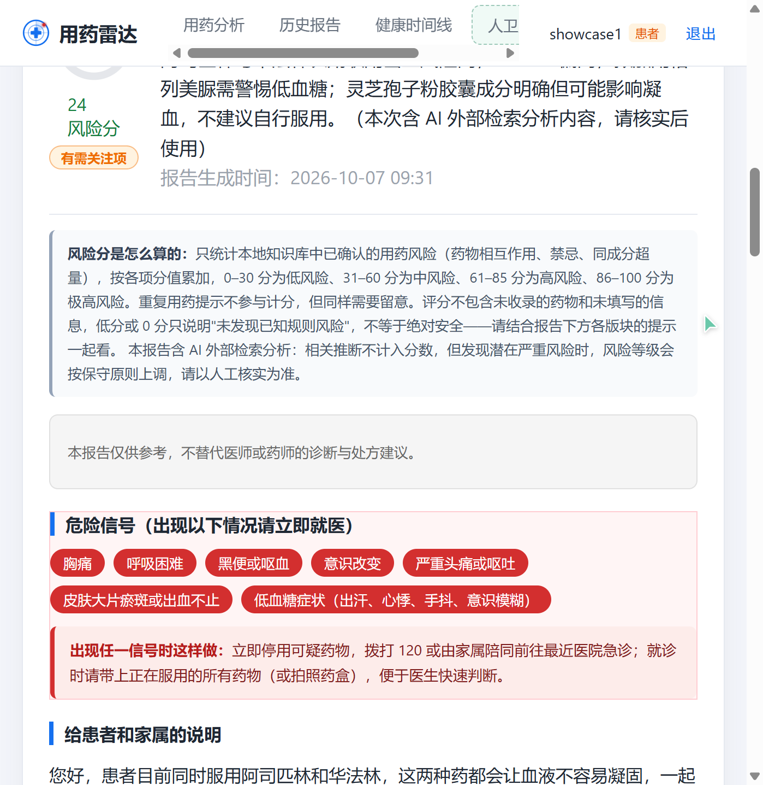
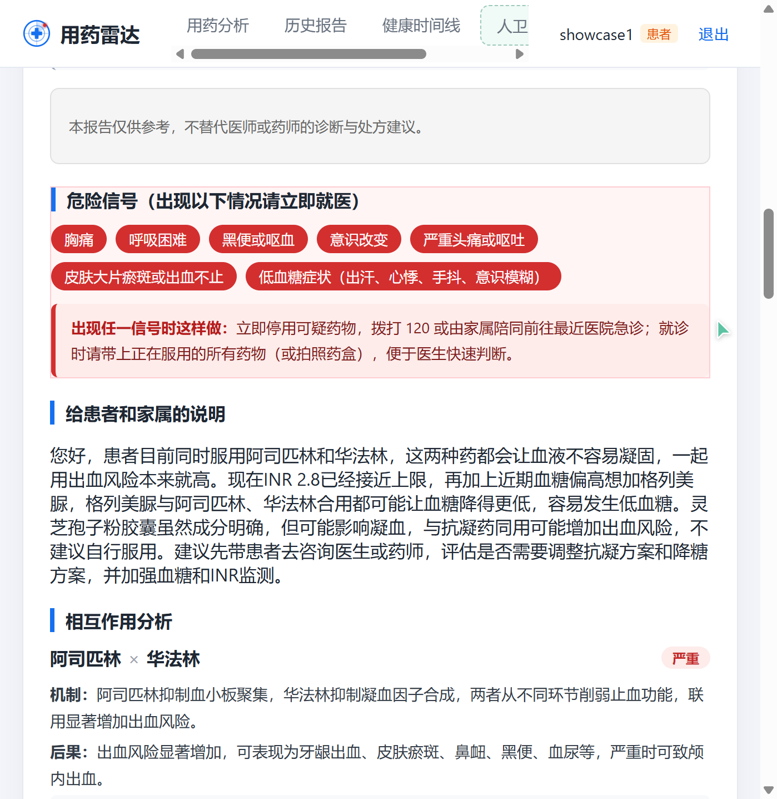
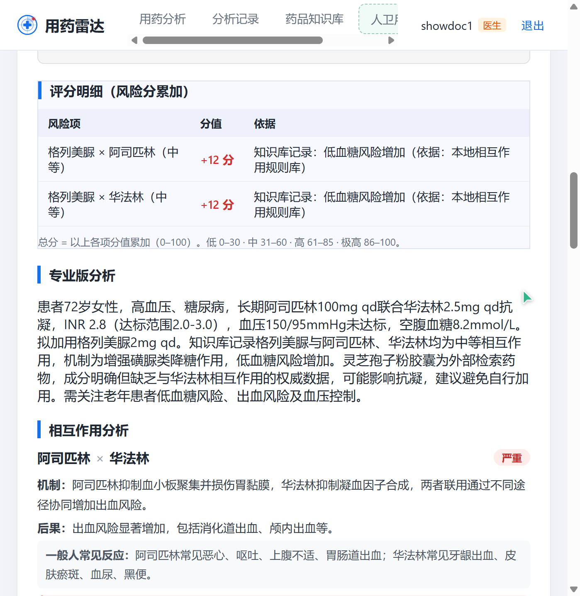
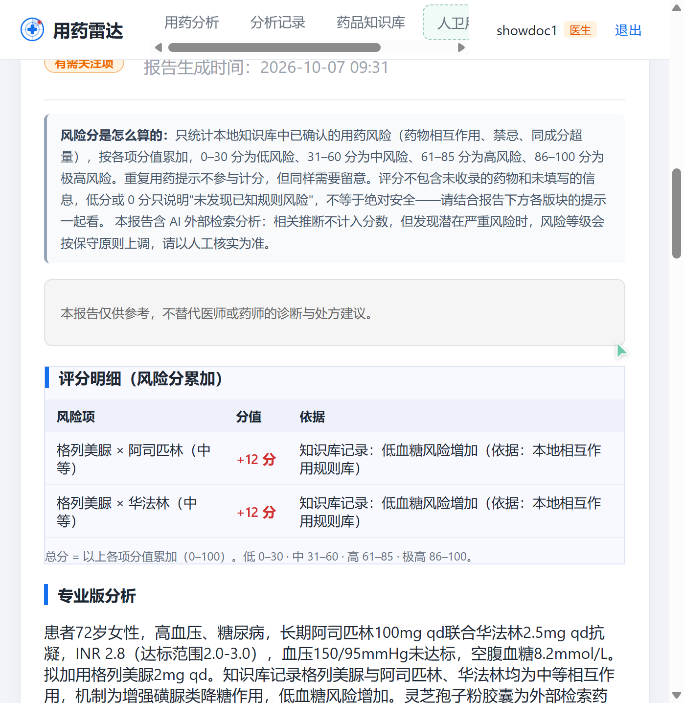

# 用药雷达 · 界面展示

> 老年多重用药安全分析平台。本地规则库 + DeepSeek 外部检索双引擎，患者 / 医生双视角分级风险报告。以下均为系统真实运行截图。

**技术栈**：React 18 · Spring Boot 3 · MySQL 8 · Redis · DeepSeek LLM

## 界面总览

## 分页截图

### 1. 欢迎页 · 产品介绍

### 2. 用药分析 · 信息填写

### 3. 患者报告 · 风险评分与 AI 外部检索

### 4. 患者报告 · 危险信号与应急指引

### 5. 患者报告 · 家属说明与严重相互作用警示

### 6. 医生视图 · 评分明细与专业分析

### 7. 医生视图 · 风险评分规则与依据

### 8. 药品知识库

### 9. 药品详情页

