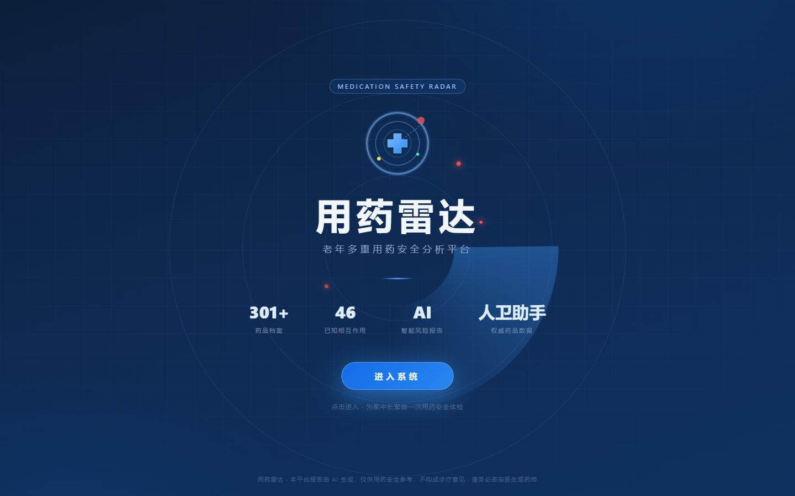
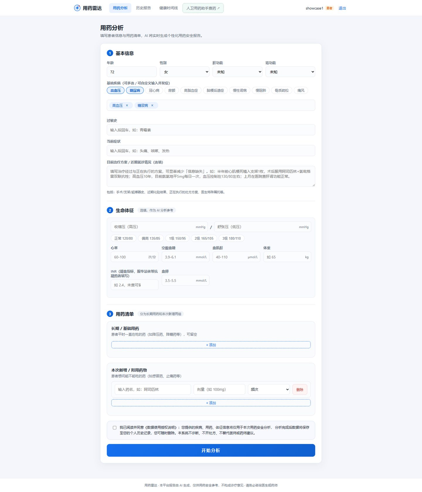
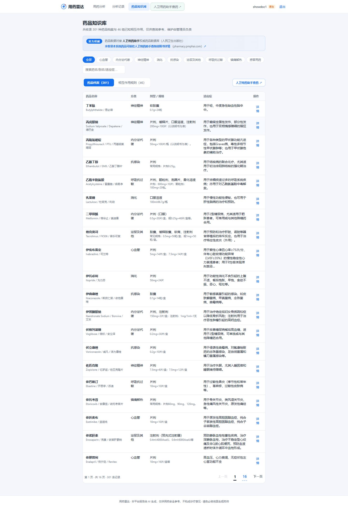
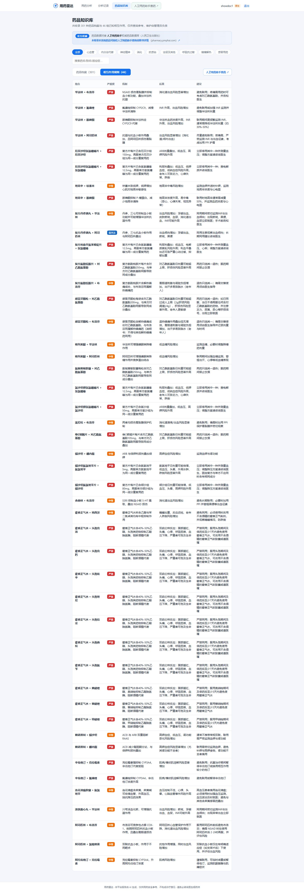
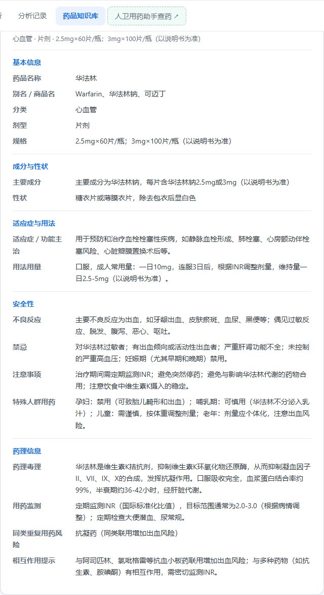
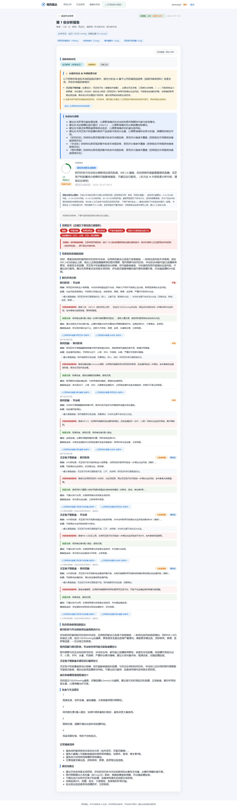
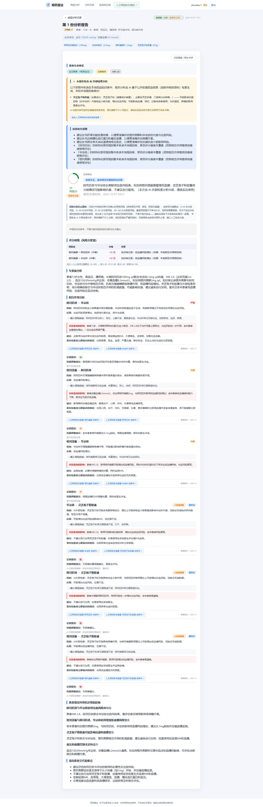
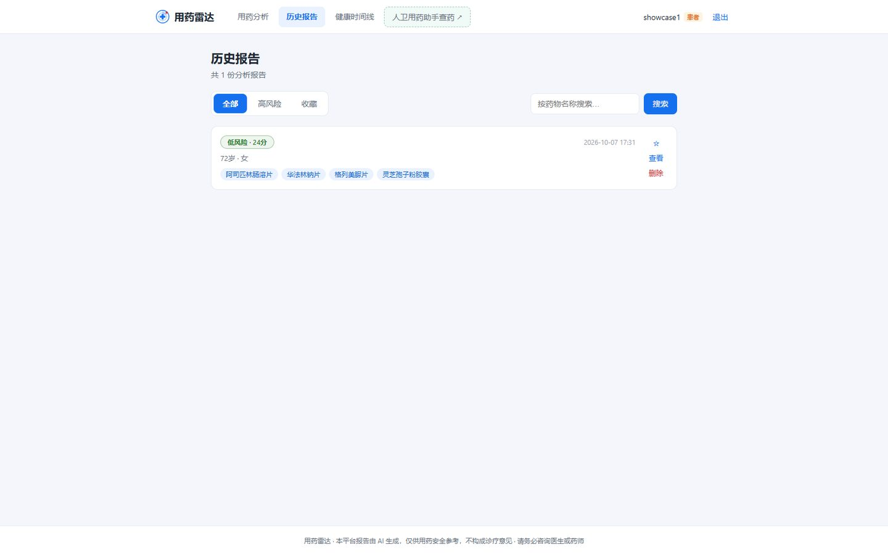
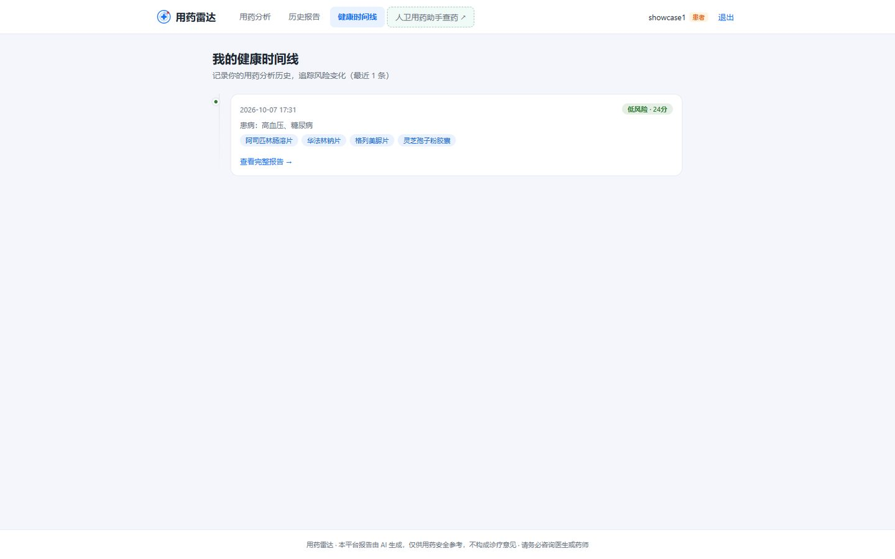

# 用药雷达 · 界面展示

> 老年多重用药安全分析平台。本地规则库 + DeepSeek 外部检索双引擎，患者 / 医生双视角分级风险报告。以下均为系统真实运行截图。

**技术栈**：React 18 · Spring Boot 3 · MySQL 8 · Redis · DeepSeek LLM

## 分页截图

### 1. 欢迎页 · 产品定位

### 2. 用药分析 · 信息填写

### 3. 药品知识库 · 301 种药品档案

收录 301 种药品与 46 组相互作用规则，数据来源为人民卫生出版社《MCDEX 药物临床信息参考》，支持分类筛选与关键词检索。

### 4. 相互作用规则库 · 46 组规则

### 5. 药品详情 · 完整档案（华法林）

### 6. 患者报告 · 风险评分与用药建议

### 7. 医生视图 · 评分明细与专业分析

### 8. 历史报告管理

### 9. 健康时间线

